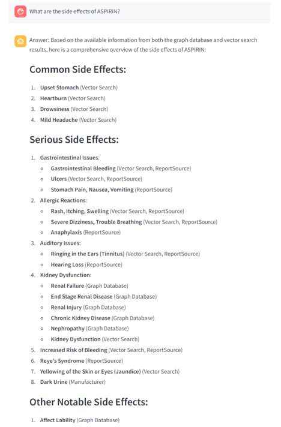
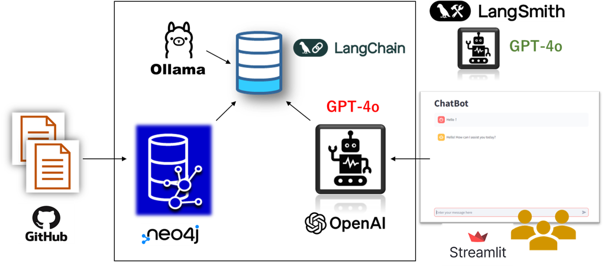

# FAERS GraphRAG System

## Acknowledgments

I would like to express my sincere gratitude and respect to the creators of the Github repository https://github.com/neo4j-graph-examples/healthcare-analytics. Their work has been a significant source of inspiration for my project, demonstrating the power of Neo4j in analyzing complex healthcare data.

I also extend my thanks to Neo4j for providing the robust graph database technology that forms the backbone of this system. Neo4j's capability to efficiently handle the vast and intricate relationships within the FDA Adverse Event Reporting System (FAERS) data has been invaluable to my work.

Furthermore, I am deeply grateful to OpenAI for developing cutting-edge large language models like GPT-4o, which significantly enhance the system's natural language processing capabilities. These models enable sophisticated and context-aware responses to user queries.

Lastly, I would like to thank LangChain for providing an excellent framework for integrating language models into real-world applications. LangChain's tools have been instrumental in building the system's GraphRAG architecture, which seamlessly combines graph database technology with vector-based retrieval and LLM-powered query processing.

## Project Background and Motivation

The inspiration for creating this system came from discovering the aforementioned Github repository. Their project demonstrates how Neo4j can be used to perform complex and advanced searches on FDA Adverse Event Reporting System data, which would have been challenging with traditional relational databases or other data solutions.

While their project is truly impressive and highly valuable, I recognized that those who are not familiar with Cypher queries or SQL might find it difficult to fully leverage its benefits. This realization motivated me to develop my own system.

My goal is to make the power of graph-based healthcare analytics more accessible to a wider audience, including those who may not have extensive experience with database query languages. By combining the strengths of graph databases, vector embeddings, and large language models, I aim to create a user-friendly system that allows for natural language querying of complex pharmaceutical and adverse event data. This approach democratizes access to valuable insights that can potentially improve patient safety and drug development processes.

My system builds upon the foundation laid by projects like the Neo4j healthcare analytics example, adding layers of abstraction and intelligence to make advanced data analysis more intuitive and accessible to researchers, healthcare professionals, and analysts across the pharmaceutical industry.

**Please note: This system is an experimental tool for making FAERS data more searchable. The results provided by this system are for reference only, and all medical decisions should be made under the guidance of qualified healthcare professionals.**

## Project Overview

This project implements a Graph Retrieval Augmented Generation (GraphRAG) system for querying and analyzing data from the FDA Adverse Event Reporting System (FAERS). It combines graph database technology with vector-based retrieval and large language models to provide comprehensive answers to complex queries about pharmaceutical adverse events.
Neo4j has proven to be extremely effective in creating a database from the vast and complex relational data of the FDA Adverse Event Reporting System (FAERS). The collaboration with LangChain and highly capable LLMs enables user-friendly data retrieval. **However, due to the complexity of the data structure, it is crucial to continuously verify the appropriateness of the search results.**



## Directory Structure

```
.
│  .env
│  docker-compose.yml
│  Dockerfile.ollama
│  run_ollama.sh
│
├─embedding_pipeline
│      data_embedding.py
│      data_import.py
│      Dockerfile
│      requirements.txt
│
└─streamlit_ui
        Dockerfile
        main.py
        requirements.txt
```
## Key Features

1. **Data Import**: Imports FAERS data into a Neo4j graph database, creating a rich, interconnected representation of adverse events, drugs, patients, and outcomes.
2. **Embedding Generation**: Generates vector embeddings for various entities in the graph, enabling semantic similarity search.
3. **GraphRAG Query System**: Utilizes both graph-based and vector-based retrieval methods to answer user queries, providing comprehensive and context-aware responses.
4. **Interactive UI**: Offers a Streamlit-based user interface for easy interaction with the system.

## Technology Stack

- **Graph Database**: Neo4j
- **Vector Embeddings**: Ollama (nomic-embed-text model)
- **Language Model**: OpenAI's GPT-4o
- **Backend**: Python with LangChain
- **Frontend**: Streamlit
- **Containerization**: Docker



## System Architecture

The system consists of several Docker containers:

1. **Neo4j**: Stores the graph representation of FAERS data.
2. **Ollama**: Generates vector embeddings for graph entities.
3. **Embedding Pipeline**: Processes graph data and generates embeddings.
4. **Streamlit UI**: Provides the user interface for querying the system.

## Key Components

### 1. Data Import (`data_import.py`)

- Imports FAERS data into Neo4j
- Creates nodes for Drug, Case, Reaction, Outcome, etc.
- Establishes relationships between entities

### 2. Embedding Generation (`data_embedding.py`)

- Generates vector embeddings for each node in the graph
- Uses Ollama's nomic-embed-text model

### 3. Query Processing (`main.py`)

- Implements a GraphRAG system using LangChain
- Combines graph-based queries with vector similarity search
- Uses GPT-4 for natural language understanding and response generation

## Setup and Deployment

1. Clone the repository.
2. Set up environment variables in the `.env` file in the root directory:

   ```bash
   NEO4J_URL=bolt://neo4j:7687
   NEO4J_USERNAME=neo4j
   NEO4J_PASSWORD=your_password
   OPENAI_API_KEY=your_openai_api_key
   ```

3. Build and run Docker containers:

   **Important**: For the first time setup, due to dependencies between containers, run the following commands in order:

   ```bash
   docker compose up neo4j
   docker compose up embedding-pipeline
   docker compose up streamlit-ui
   ```

   After the initial setup, you can start all containers at once using:

   ```bash
   docker compose up -d
   ```

4. Access the UI at `http://localhost:8501`.

## Usage

- Enter natural language queries about adverse drug events, drug interactions, patient demographics, etc.
- The system generates detailed responses based on the FAERS data and AI-powered analysis.

## Future Improvements

- Integration with real-time FAERS data updates.
- Enhanced visualization of query results.
- Support for more complex multi-hop queries.
- Fine-tuning of language models on pharmaceutical domain knowledge.

## License

This project is licensed under the MIT License.

## Appendix: Evaluation of GraphCypherQAChain

To ensure the generated Cypher queries from the GraphCypherQAChain are accurate, efficient, and easy to understand, I implemented an evaluation system using LangSmith. This system helps me monitor the quality of the generated queries based on predefined criteria.

The evaluation process is based on real user questions and Cypher queries, which I obtained from the [Neo4j Healthcare Analytics](https://github.com/neo4j-graph-examples/healthcare-analytics) repository. I assess the system-generated queries using the following criteria:

1. Correctness: Does the generated Cypher query correctly answer the natural language input?
2. Efficiency: Is the generated Cypher query optimized and efficient?
3. Readability: Is the generated Cypher query easy to read and understand?

Each criterion was scored from 0 to 5, with the overall evaluation being the average of these three scores.

To implement the evaluation process, I created Python code with the following key functionalities:

1. Creation of custom evaluation functions:
   - Generates evaluation functions based on evaluation type (correctness, efficiency, readability, overall)
   - Uses GPT-4o to perform evaluations and parse results

2. Execution of evaluations:
   - Initializes LangSmith client
   - Sets up custom evaluators
   - Runs evaluations on the dataset

```python
def create_evaluation_function(score_type: ScoreType) -> Callable[[Run, Example | None], EvaluationResult]:
    # Logic to generate evaluation function
    @run_evaluator
    def evaluator(run: Run, example: Example | None = None) -> EvaluationResult:
        evaluation = create_evaluation_chain(init_llm()).run(
            input=example.inputs["input"], 
            generated_cypher=run.outputs["output"],
            expected_cypher=example.outputs["output"],
            cypher_schema=cypher_schema,
        )
        parsed_result = parse_evaluation_result(evaluation)
        scores: Dict[str, float] = parsed_result["scores"]
        
        explanation = parsed_result["explanation"]

        score_mapping = {
            "overall": "Overall Score",
            "correctness": "Correctness Score",
            "efficiency": "Efficiency Score",
            "readability": "Readability Score",
        }
        
        return EvaluationResult(
            key="custom_evaluator",
            score=scores.get(score_mapping[score_type], 0),
            comment=f"Score Type: {score_type}\nExplanation: {explanation}"
        )
    return evaluator

def run_evaluation(dataset_name: str, project_name: str):
    # Main function to run the evaluation process
    # Initializes LLM, sets up evaluation config, runs on dataset
    """Run the evaluation process."""
    try:
        llm = init_llm()
        cypher_generation_chain = create_cypher_generation_chain(llm)

        client = Client()

        custom_evaluator_overall = create_evaluation_function("overall")
        custom_evaluator_correctness = create_evaluation_function("correctness")
        custom_evaluator_efficiency = create_evaluation_function("efficiency")
        custom_evaluator_readability = create_evaluation_function("readability")

        evaluation_config = RunEvalConfig(
            custom_evaluators=[
                custom_evaluator_overall, 
                custom_evaluator_correctness, 
                custom_evaluator_efficiency, 
                custom_evaluator_readability,
            ]
        )

        def generate_query(x):
            return {"output": generate_cypher_query(cypher_generation_chain, cypher_schema, x["input"])}

        run_on_dataset(
            client=client,
            llm_or_chain_factory=generate_query,
            dataset_name=dataset_name,
            evaluation=evaluation_config,
            project_name=project_name,
            verbose=True
        )
```
This code allows for automatic evaluation of the quality of generated Cypher queries, enabling continuous monitoring and improvement of the system's performance.

The evaluation Python file "eval_cypher_gen.py" is available in this repository for your use. Please note that I conducted this evaluation using a local Neo4j database setup, not within the Docker container. If you wish to run the evaluation file within the Docker container, some customization of the source code may be necessary.

